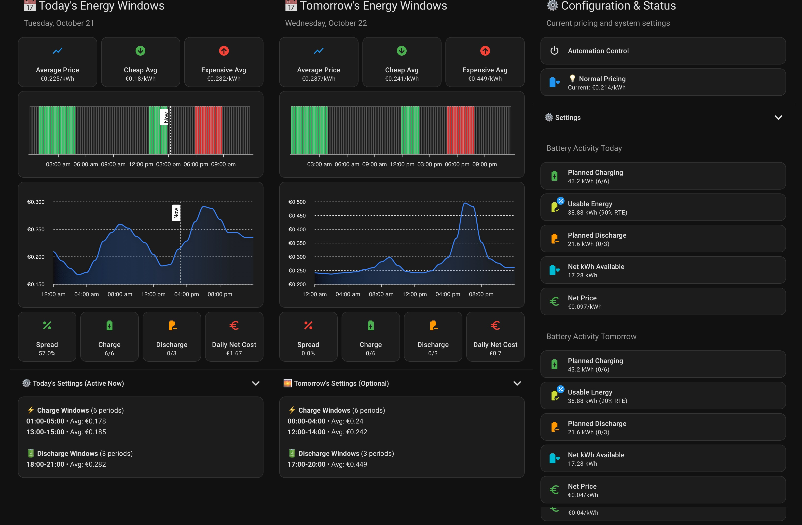

# Cheapest Energy Windows for Home Assistant

[](https://github.com/hacs/integration)
[](https://github.com/cew-hacs/cheapest_energy_windows/releases)
[](LICENSE)

Optimize your energy consumption and battery storage by automatically identifying the cheapest charging windows and most expensive discharging periods based on dynamic electricity prices from Nord Pool.

## Dashboard Preview



## Supported Price Sensors

This integration is designed to work with **Nord Pool** dynamic electricity pricing. It requires a Nord Pool price sensor integration such as:
- [Nordpool](https://github.com/custom-components/nordpool) - Provides hourly electricity prices for Nordic and Baltic countries

While primarily designed for Nord Pool data structure, it may work with other dynamic pricing sensors that provide hourly price data in a similar format (ENTSO-E, Tibber with modifications).

## Features

- **Smart Window Detection**: Automatically identifies optimal charge/discharge windows based on electricity prices
- **Percentile-Based Selection**: Uses statistical analysis to find truly cheap and expensive periods
- **Progressive Window Selection**: Ensures spread requirements are met for profitability
- **Battery Management**: Control battery charging and discharging based on price optimization
- **Dual-Day Management**: Configure different settings for today and tomorrow
- **Time Overrides**: Set specific time periods to force charging or discharging
- **Comprehensive Dashboard**: Full control interface with real-time status and analytics
- **Automation Support**: Built-in automation for midnight settings rotation and state-based control

## Installation

### HACS Installation (Recommended)

1. Open HACS in your Home Assistant instance
2. Click on "Integrations"
3. Click the three dots menu and select "Custom repositories"
4. Add this repository URL and select "Integration" as the category
5. Click "Add"
6. Search for "Cheapest Energy Windows"
7. Click "Download"
8. Restart Home Assistant
9. Go to Settings > Devices & Services
10. Click "Add Integration"
11. Search for "Cheapest Energy Windows"
12. Follow the configuration wizard

### Manual Installation

1. Copy the `custom_components/cheapest_energy_windows` folder to your Home Assistant `custom_components` directory
2. Restart Home Assistant
3. Go to Settings > Devices & Services
4. Click "Add Integration"
5. Search for "Cheapest Energy Windows"
6. Follow the configuration wizard

## Configuration

### Initial Setup

During the configuration flow, you'll be asked to:

1. **Choose setup mode**:
   - Guided Setup (recommended for new users)
   - Quick Setup (for advanced users)

2. **Select your Nord Pool price sensor**: The integration will auto-discover Nord Pool price sensors in your Home Assistant instance

3. **Configure pricing parameters**:
   - VAT percentage
   - Additional tax (€/kWh)
   - Fixed additional costs (€/kWh)

4. **Battery settings** (optional):
   - Charge power (Watts)
   - Discharge power (Watts)
   - Round-trip efficiency (%)

### Dashboard Installation

After setting up the integration, install the dashboard:

1. Go to Developer Tools > Actions
2. Search for `cheapest_energy_windows.install_dashboard`
3. Choose dashboard type:
   - **CEW Control Dashboard**: Full control interface for the integration
   - **Energy Monitoring Dashboard**: General energy monitoring
4. Click "Perform Action"
5. Access your new dashboard from the sidebar

## How It Works

### Window Selection Algorithm

1. **Percentile Filtering**:
   - Identifies the cheapest X% of hours for charging
   - Identifies the most expensive Y% of hours for discharging

2. **Progressive Selection**:
   - Starts with most extreme prices
   - Adds windows while maintaining minimum spread requirements
   - Ensures profitability considering round-trip efficiency

3. **Spread Calculation**:
   ```
   Spread = ((expensive_price - cheap_price) / cheap_price) * 100
   ```

4. **State Determination**:
   - **Charge**: Current hour is in cheap windows and spread requirement met
   - **Discharge**: Current hour is in expensive windows and spread requirement met
   - **Discharge Aggressive**: Current hour meets aggressive discharge spread
   - **Idle**: No conditions met
   - **Off**: Automation disabled

### Entities Created

The integration creates 64 configuration entities:

#### Sensors
- `sensor.cew_today`: Current state and window information for today
- `sensor.cew_tomorrow`: Window information for tomorrow (when available)

#### Input Numbers (24)
- Window counts (charging, expensive)
- Percentiles (cheap, expensive)
- Spreads (minimum, discharge, aggressive)
- Costs (VAT, tax, additional)
- Battery parameters (power, efficiency)
- Price overrides

#### Input Booleans (18)
- Automation enable/disable
- Notification settings
- Time override enables
- Tomorrow settings

#### Input Selects (7)
- Window duration mode
- Time override modes

#### Input DateTimes (14)
- Time override periods
- Quiet hours

#### Input Text (1)
- Price sensor entity ID

## Services

### cheapest_energy_windows.rotate_settings
Apply tomorrow's settings to today. Automatically triggered at midnight when enabled.

### cheapest_energy_windows.install_dashboard
Install pre-configured dashboards to your Lovelace interface.

Parameters:
- `dashboard_name`: Name for the dashboard (optional)
- `dashboard_type`: "cew" or "energy" (optional)

## Automation Examples

### React to State Changes

```yaml
automation:
  - alias: "Battery Charge on Cheap Energy"
    trigger:
      - platform: state
        entity_id: sensor.cew_today
        to: 'charge'
    action:
      - service: switch.turn_on
        target:
          entity_id: switch.battery_charge

  - alias: "Battery Discharge on Expensive Energy"
    trigger:
      - platform: state
        entity_id: sensor.cew_today
        to: 'discharge'
    action:
      - service: switch.turn_on
        target:
          entity_id: switch.battery_discharge
```

### Use Window Attributes

```yaml
automation:
  - alias: "Notify Charging Windows"
    trigger:
      - platform: time
        at: "07:00:00"
    action:
      - service: notify.mobile_app
        data:
          title: "Today's Charging Windows"
          message: >
            Charging windows: {{ state_attr('sensor.cew_today', 'cheapest_times') | join(', ') }}
            Average price: €{{ state_attr('sensor.cew_today', 'avg_cheap_price') | round(5) }}/kWh
```

## Sensor Attributes

### sensor.cew_today

- `cheapest_times`: List of charging window times
- `cheapest_prices`: Corresponding prices for charging windows
- `expensive_times`: List of discharge window times
- `expensive_prices`: Corresponding prices for discharge windows
- `expensive_times_aggressive`: Aggressive discharge windows
- `expensive_prices_aggressive`: Prices for aggressive discharge
- `spread_avg`: Average spread percentage
- `spread_met`: Whether minimum spread requirement is met
- `current_price`: Current electricity price
- `avg_cheap_price`: Average price of cheap windows
- `avg_expensive_price`: Average price of expensive windows
- `completed_charge_windows`: Number of completed charge windows today
- `completed_discharge_windows`: Number of completed discharge windows
- `completed_charge_cost`: Total cost of charging today
- `completed_discharge_revenue`: Total revenue from discharging today

## Dashboard Features

### CEW Control Dashboard

- **Status Overview**: Current state, price, and spread information
- **Window Configuration**: Adjust window counts and percentiles
- **Spread Settings**: Configure minimum spreads for profitability
- **Cost Settings**: VAT, tax, and additional costs
- **Battery Settings**: Power limits and efficiency
- **Tomorrow Settings**: Configure different parameters for tomorrow
- **Time Overrides**: Force charging/discharging during specific periods
- **Notifications**: Configure alerts for state changes
- **Analytics**: View windows, statistics, and price analysis

## Troubleshooting

### No Windows Detected

1. Check that your price sensor is providing data
2. Verify percentile settings aren't too restrictive
3. Ensure minimum spread isn't set too high
4. Check if price override is active

### Tomorrow Sensor Shows "Unavailable"

This is normal. Tomorrow's prices typically become available between 13:00-14:00 (varies by provider).

### Settings Not Rotating at Midnight

1. Ensure "Tomorrow Settings Enabled" is turned on
2. Check that automation is enabled
3. Verify Home Assistant time zone is correct

## Performance

The integration uses an optimized calculation engine that:
- Caches results for 14 minutes 59 seconds
- Uses NumPy for efficient array operations
- Only recalculates when prices or settings change
- Typical calculation time: <100ms (vs 500-1000ms for YAML templates)

## Contributing

Contributions are welcome! Please:
1. Fork the repository
2. Create a feature branch
3. Make your changes
4. Submit a pull request

## License

This project is licensed under the MIT License - see the [LICENSE](LICENSE) file for details.

## Acknowledgments

- Home Assistant Community for inspiration and support
- Nordpool integration for price data structure
- All contributors and testers

## Support

For issues, questions, or suggestions:
- Open an issue on [GitHub](https://github.com/cew-hacs/cheapest_energy_windows/issues)
- Join the discussion on [Home Assistant Community](https://community.home-assistant.io/)

## Changelog

### Version 1.0.0
- Initial release
- Full feature parity with YAML package
- HACS compatible structure
- Performance optimizations
- Comprehensive dashboard